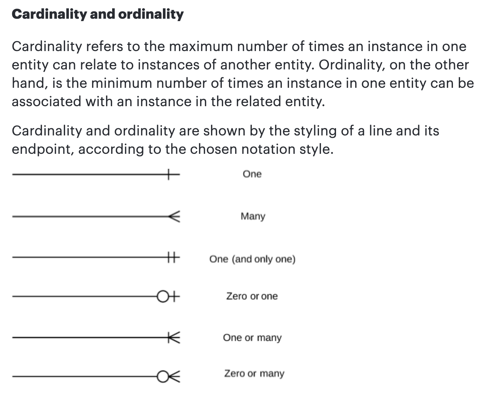

# Introduction to Relational Databases

## What is a Database (DB)

- **Definition:** A database is a structured collection of data that is organized in a way that makes it easy to manage, access, and update. It is designed to efficiently store and retrieve large amounts of information.
- **Purpose:** Facilitate data management, storage, and retrieval for various applications.

## Relational vs. Non-Relational Databases

### SQL vs. NoSQL

| Feature                        | SQL Databases                          | NoSQL Databases                         |
| ------------------------------ | -------------------------------------- | --------------------------------------- |
| **Data Model**                 | Relational (tables with rows and columns) | (Not Only SQL) Non-relational (document, key-value, column-family, graph) |
| **Schema**                     | Fixed schema, predefined tables and columns | Dynamic schema, flexible data model |
| **Query Language**             | Structured Query Language (SQL)        | Varies (e.g., JSON queries for document stores, CQL for column-family stores) |
| **ACID Compliance**            | Full ACID compliance (Atomicity, Consistency, Isolation, Durability) | Some NoSQL databases offer eventual consistency, BASE model (Basically Available, Soft state, Eventual consistency) |
| **Scalability**                | Vertical scalability (scaling up by adding more power to existing hardware) | Horizontal scalability (scaling out by adding more servers) |
| **Use Cases**                  | Structured data, complex queries, transactions (e.g., banking systems, ERP) | Unstructured/semi-structured data, large-scale data, real-time applications (e.g., social media, big data analytics) |
| **Examples**                   | MySQL, PostgreSQL, SQLite, Oracle      | MongoDB, Cassandra, Redis, Neo4j        |

- **Relational Databases (SQL):**
  - **Structure:** Constructed using SQL (Structured Query Language) and a DBMS (Database Management System).
  - **Components:** Comprise multiple tables with:
    - **Columns:** Dictate properties/attributes and data types stored in the table.
    - **Rows:** Depict each entry stored in the database.

## Normalization

- **Goal:** Eliminate redundancy and improve data integrity.
- **Rules:**
  - Each row is unique.
  - Each cell contains only a single value.
  - Organizes data into tables to reduce duplication and dependency.

## Keys

- **Primary Keys:**
  - A unique identifier for each entry in a table.
  - Used to reference individual records.
  - Example: In a "Users" table, "user_id" can be a primary key.
- **Foreign Keys:**
  - Primary keys from other tables used to reference entries.
  - Help establish relationships between tables without duplicating data.
  - Example: In an "Orders" table, "user_id" can be a foreign key referencing "user_id" in the "Users" table.

## Relationships

- **Definition:** How tables are connected to each other, creating a web of references for efficient data storage.
- **Types of Relationships:**
  - **One-to-One:** An entity in one table connects to one entity in another table.
    - Country to Capital: Each country has one capital, and each capital belongs to one country.
  - **One-to-Many:** An entity in one table can connect to multiple entities in another table.
    - Owner to Cars: An owner can have multiple cars, but a car is owned by one person.
    - Customer to Orders: A customer can place multiple orders, but each order is associated with one customer.
  - **Many-to-Many:** Entities in one table can connect to multiple entities in another table and vice versa.
    - **Requires a junction table**.
    - Orders to Items: An order can include many kinds of items, and an item can be included in many orders.

## Entity Relationship Diagram (ERD)

- **Tool:** [Lucidchart](https://lucid.app/)
- **Purpose:** Visual representation of database tables and their relationships.
- **Components:**
  - **Tables:** Display columns, data types, and keys.
  - **Cardinality:** Shows the kind of relationship between database tables (one-to-many, many-to-many).
  - **Example Datatypes:** Refer to [W3Schools MySQL Datatypes](https://www.w3schools.com/mysql/mysql_datatypes.asp).

### **Cardinality & Ordinality Symbols:**

- **Design Tips:**
  - Ensure each table has a primary key.
  - Use foreign keys to maintain data integrity.
  - Normalize data to reduce redundancy.

- **Creating ERDs:**
  - Identify entities (tables).
  - Determine relationships (one-to-one, one-to-many, many-to-many).
  - Define attributes (columns) and data types.

## Database Management System (DBMS)

- **Definition:** Software that allows construction and communication with a database.
- **Popular DBMS:**
  - **MySQL:** Versatile for a wide range of needs, from small websites to large-scale enterprise applications.
  - **PostgreSQL:** Advanced data manipulation, standards adherence, and robust extensibility.
  - **SQLite:** Efficient for creating small-scale databases, but not suitable for heavy data interactions.

### Further Reading

- [Introduction to SQL](https://www.w3schools.com/sql/)
- [Database Normalization](https://www.w3schools.com/sql/sql_ref_integrity.asp)
- [Lucidchart Tutorial](https://www.lucidchart.com/pages/tutorials).
  